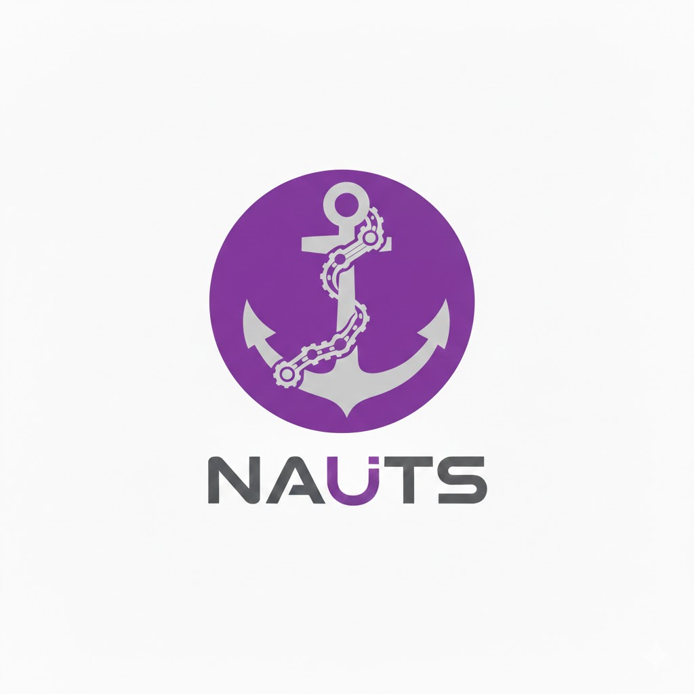

<div style="display: flex; align-items: center;">
  <div style="flex-shrink: 0;">
    
  </div>
  <div style="margin-left: 20px">
    <h1>NAUTS</h1>
    <b>N</b>ATS <b>Aut</b>hentication <b>S</b>ervice
  </div>
</div>

## Overview

nauts is a framework for scalable, human-friendly permission management for [NATS](https://nats.io). It bridges external identity providers with NATS authentication using high-level policies that compile to low-level NATS permissions.

### Key Features

- **Policy-Based Access Control**: Define permissions using intuitive policies with actions like `nats.pub`, `js.consume`, `kv.read` instead of raw NATS subjects.
- **Role-Based Authorization**: Assign policies to roles, and roles to users via account-scoped role bindings.
- **Variable Interpolation**: Scope resources dynamically with `{{ user.id }}`, `{{ account.id }}`, `{{ role.id }}` (alias: `{{ role.name }}`), and `{{ user.attr.<key> }}`.
- **Multiple Identity Providers**: Authenticate users via file-based credentials, external JWTs (Keycloak, Auth0, Okta), AWS SigV4 (IAM roles), or custom providers.
- **NATS Auth Callout**: Built-in service implementing [NATS auth callout protocol](https://docs.nats.io/running-a-nats-service/configuration/securing_nats/auth_callout).
- **Dynamic Policy Storage**: Store policies in NATS KV for live updates without service restarts, or use simple JSON files for static setups.
- **Operator & Static Modes**: Works with NATS operator/account hierarchies or simple single-key deployments.

## Quick Start

### Installation

```bash
go build -o bin/nauts ./cmd/nauts
```

### Server Setup

Run the NATS server and the nauts auth service:

```bash
# 1. Start NATS server (configured for auth callout)
nats-server -c nats-server.conf

# 2. Start nauts auth service
./bin/nauts serve -c nauts.json
```

### Authenticate

Connect using NATS tooling with a token formatted for nauts:

```bash
# Format: {"account":"APP","token":"username:password"}
nats --token '{"account":"APP","token":"alice:secret"}' pub "my.subject" "hello"
```

## Concepts

### Architecture

nauts sits between your users and the NATS server. When a client connects, NATS delegates authentication to nauts via the **Auth Callout** protocol. nauts verifies the credentials, resolves the user's roles, compiles applicable policies into NATS permissions, and returns a signed short-lived User JWT.

```
Client                      NATS Server                     nauts
  │                              │                            │
  │ CONNECT (Token)              │                            │
  │─────────────────────────────►│    Auth Callout            │
  │                              │───────────────────────────►│
  │                              │                            │ 1. Verify Identity
  │                              │                            │ 2. Resolve Roles
  │                              │                            │ 3. Compile Permissions
  │                              │    User JWT                │
  │                              │◄───────────────────────────│
  │ OK                           │                            │
  │◄─────────────────────────────│                            │
```

### Policies & Actions

Permissions are defined in `policies.json`. Instead of writing complex NATS subject rules, you use high-level **Actions**.

| Category | Actions | Description |
|---|---|---|
| **Core NATS** | `nats.pub` | Publish messages to subjects. |
| | `nats.sub` | Subscribe to subjects (including queues). |
| | `nats.service` | Subscribe and respond (Req/Reply service). |
| **JetStream** | `js.view` | View stream and consumer details (read-only info). |
| | `js.consume` | Consume messages from streams. |
| | `js.manage` | Create, update, delete streams and consumers. |
| **Key-Value** | `kv.read` | Get values from buckets (including watches). |
| | `kv.edit` | Put and delete values in buckets. |
| | `kv.view` | View bucket details (read-only info). |
| | `kv.manage` | Create, update, delete buckets. |

See [POLICY.md](./POLICY.md) for the full specification.

### Variable Interpolation

Policies can use variables to create dynamic, user-scoped permissions:

*   `nats:user.{{ user.id }}.>` - Private subject for the user.
*   `kv:private_{{ account.id }}` - Private bucket for the account.

## Configuration

nauts is configured via a JSON file defining the account mode, policy storage, and auth providers.

### Example: Static Mode

```json
{
  "account": {
    "type": "static",
    "static": {
      "publicKey": "ACONFIG...", 
      "privateKeyPath": "issuer.nk",
      "accounts": ["APP", "SYS"]
    }
  },
  "policy": {
    "type": "file",
    "file": {
      "policiesPath": "policies.json",
      "bindingsPath": "bindings.json"
    }
  },
  "auth": {
    "file": [{ "id": "local", "accounts": ["APP"], "userPath": "users.json" }]
  }
}
```

### Example: NATS KV Policy Provider

Policies and bindings can be stored in a NATS KV bucket instead of JSON files, enabling dynamic updates without service restarts.

```json
{
  "policy": {
    "type": "nats",
    "nats": {
      "bucket": "nauts-policies",
      "natsUrl": "nats://localhost:4222",
      "natsNkey": "./policy-reader.nk",
      "cacheTtl": "30s"
    }
  }
}
```

The KV bucket must exist before nauts starts. Policies are stored under `<account>.policy.<id>` keys and bindings under `<account>.binding.<role>` keys. A background watcher invalidates cached entries on change; `cacheTtl` controls the maximum staleness (default: 30s).

## Identity Providers

nauts supports plugging in different identity providers (you can configure more than one).

### File Provider
Simple `users.json` file with bcrypt-hashed passwords. Good for service accounts or small setups.

### JWT Provider
Validates OIDC/JWT tokens from external Identity Providers (Keycloak, Auth0, Okta). Application authentication is handled by your IdP; nauts just enforces the permissions based on the token's claims.

```json
"auth": {
  "jwt": [{
    "id": "keycloak",
    "accounts": ["tenant-*"],
    "issuer": "https://idp.example.com",
    "publicKey": "...",
    "rolesClaimPath": "realm_access.roles"
  }]
}

```

### AWS SigV4 Provider
Authenticates AWS workloads using IAM role identity via SigV4-signed requests to AWS STS `GetCallerIdentity`. AWS role names must follow: `nauts.<nats-account>.<nats-role>`.

```json
"auth": {
  "aws": [{
    "id": "aws-us-east-1",
    "accounts": ["prod-*"],
    "region": "us-east-1",
    "maxClockSkew": "5m",
    "awsAccount": "123456789012"
  }]
}
```

## Documentation

- [POLICY.md](./POLICY.md) - Detailed Policy and Action reference.
- [IMPLEMENTATION.md](./IMPLEMENTATION.md) - Internal architecture and package details.
- [e2e/](./e2e/README.md) - End-to-End tests and setups.

## License

MIT
