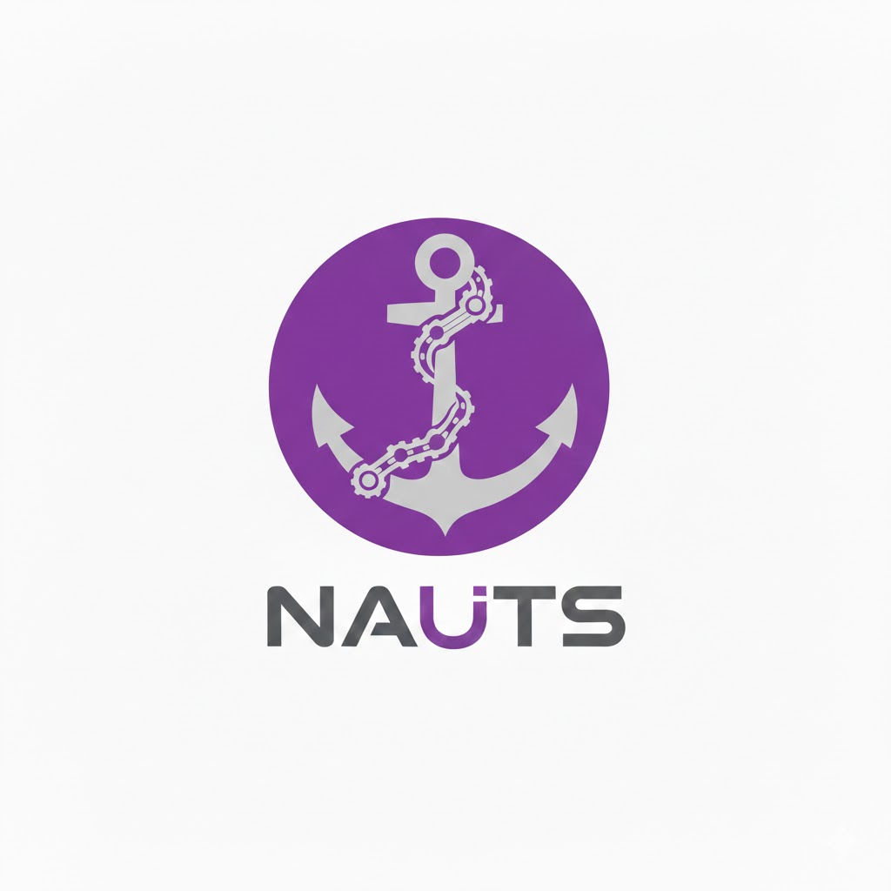

<div style="display: flex; align-items: center;">
  <div style="flex-shrink: 0;">
    
  </div>
  <div style="margin-left: 20px">
    <h1>NAUTS</h1>
    <b>N</b>ATS <b>Aut</b>hentication <b>S</b>ervice
  </div>
</div>

## Overview

nauts is a framework for scalable, human-friendly permission management for [NATS](https://nats.io). It bridges external identity providers with NATS authentication using high-level policies that compile to low-level NATS permissions.

### Key Features

- **Policy-Based Access Control**: Define permissions using intuitive policies with actions like `nats.pub`, `js.consume`, `kv.read` instead of raw NATS subjects
- **Role-Based Authorization**: Assign policies to roles, and roles to users. Supports both global roles (`account: "*"`) and account-specific roles
- **Variable Interpolation**: Scope resources dynamically with `{{ user.id }}`, `{{ user.account }}`, `{{ role.name }}`
- **Multiple Identity Providers**: Authenticate users via file-based credentials, external JWTs (Keycloak, Auth0, etc.), or custom providers
- **NATS Auth Callout**: Built-in service implementing [NATS auth callout protocol](https://docs.nats.io/running-a-nats-service/configuration/securing_nats/auth_callout)
- **Operator & Static Modes**: Works with NATS operator/account hierarchies or simple single-key deployments

## Quick Start

### Installation

```bash
go build -o bin/nauts ./cmd/nauts
```

### One-Shot Authentication

```bash
# Get a signed NATS JWT for a user
./bin/nauts auth -c nauts.json -token '{"account":"APP","token":"alice:secret"}'
```

### Run Auth Callout Service

```bash
# Start NATS server
nats-server -c nats-server.conf

# Start nauts auth service
./bin/nauts serve -c nauts.json
```

### Connect with Token

```bash
# Static mode - just use token
nats --token '{"account":"APP","token":"alice:secret"}' sub "public.>"

# Operator mode - requires sentinel credentials + token
nats --creds sentinel.creds --token '{"account":"APP","token":"alice:secret"}' sub "public.>"
```

## How It Works

```
User Request                nauts                           NATS Server
     │                        │                                  │
     │  Connect with token    │                                  │
     ├────────────────────────┼──────────────────────────────────►
     │                        │   Auth callout request           │
     │                        │◄─────────────────────────────────┤
     │                        │                                  │
     │                        │  1. Verify token (identity provider)
     │                        │  2. Resolve user roles           │
     │                        │  3. Compile policies → NATS perms│
     │                        │  4. Sign user JWT                │
     │                        │                                  │
     │                        │   Auth callout response (JWT)    │
     │                        ├──────────────────────────────────►
     │                        │                                  │
     │  Connection established │                                  │
     │◄───────────────────────┼──────────────────────────────────┤
```

## Configuration

nauts uses a JSON configuration file. Here's a minimal example:

```json
{
  "account": {
    "type": "static",
    "static": {
      "publicKey": "AXXXXX...",
      "privateKeyPath": "account.nk",
      "accounts": ["APP"]
    }
  },
  "policy": {
    "type": "file",
    "file": { "policiesPath": "policies.json", "rolesPath": "roles.json" }
  },
  "auth": {
    "file": [
      {
        "id": "local",
        "accounts": ["APP"],
        "userPath": "users.json"
      }
    ]
  },
  "server": {
    "natsUrl": "nats://localhost:4222",
    "natsNkey": "auth-service.nk",
    "ttl": "1h"
  }
}
```

## Example Data Files

### roles.json

```json
[
  { "name": "default", "account": "*", "policies": [] },
  { "name": "readonly", "account": "*", "policies": ["read-access"] },
  { "name": "admin", "account": "APP", "policies": ["read-access", "write-access"] }
]
```

### policies.json

```json
[
  {
    "id": "read-access",
    "name": "Read Access",
    "statements": [
      { "effect": "allow", "actions": ["nats.sub"], "resources": ["nats:public.>"] }
    ]
  },
  {
    "id": "write-access",
    "name": "Write Access",
    "statements": [
      { "effect": "allow", "actions": ["nats.pub"], "resources": ["nats:public.>"] }
    ]
  }
]
```

### users.json (file auth provider)

```json
{
  "users": {
    "alice": {
      "accounts": ["APP"],
      "roles": ["readonly"],
      "passwordHash": "$2a$10$..."
    }
  }
}
```

## Authentication Providers

### File-Based (username/password)

Static user list with bcrypt password hashes.

Token format: `{"account":"APP","token":"username:password"}`

Optional provider selection: `{"account":"APP","token":"username:password","ap":"local"}`

### JWT-Based (external IdP)

Verify JWTs from external identity providers like Keycloak or Auth0.

```json
{
  "auth": {
    "jwt": [
      {
        "id": "keycloak",
        "accounts": ["tenant-*"],
        "issuer": "https://keycloak.example.com/realms/myrealm",
        "publicKey": "<base64 encoded PEM public key>",
        "rolesClaimPath": "resource_access.nauts.roles"
      }
    ]
  }
}
```

Roles in JWT claims follow format `<account>.<role>` (e.g., `tenant-a.admin`).

If multiple auth providers are configured, the request can set `ap` to pick a provider by id. If `ap` is omitted, nauts auto-selects the single provider whose `accounts` patterns match the requested `account`.

## Policy Specification

Policies use a simple DSL to define permissions. See [POLICY.md](./POLICY.md) for the complete specification.

### Actions

| Category | Actions |
|----------|---------|
| Core NATS | `nats.pub`, `nats.sub`, `nats.req` |
| JetStream | `js.readStream`, `js.writeStream`, `js.consume`, `js.*` |
| KV Store | `kv.read`, `kv.write`, `kv.watchBucket`, `kv.*` |

### Resources

```
nats:<subject>           # NATS subject
nats:<subject>:<queue>   # Queue subscription
js:<stream>              # JetStream stream
js:<stream>:<consumer>   # JetStream consumer
kv:<bucket>              # KV bucket
kv:<bucket>:<key>        # KV key
```

### Variable Interpolation

```json
{
  "resources": [
    "nats:user.{{ user.id }}.>",
    "kv:config:{{ user.attr.tenant }}.>"
  ]
}
```

## Documentation

- [POLICY.md](./POLICY.md) - Complete policy specification
- [IMPLEMENTATION.md](./IMPLEMENTATION.md) - Architecture and implementation details
- [test/](./test/) - Example configurations and e2e tests

## Running Tests

```bash
# Unit tests
go test ./...

# E2E tests
cd test
go test -v -static .    # Static mode
go test -v -operator .  # Operator mode
```

## License

MIT
